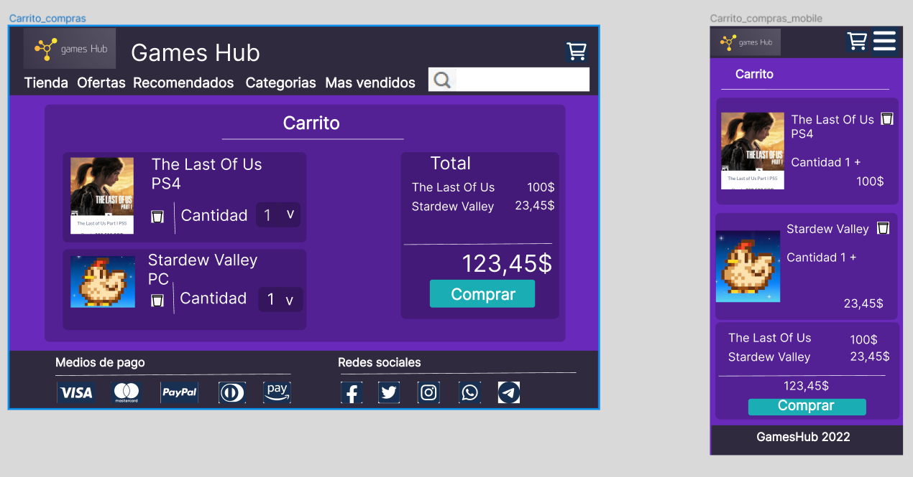
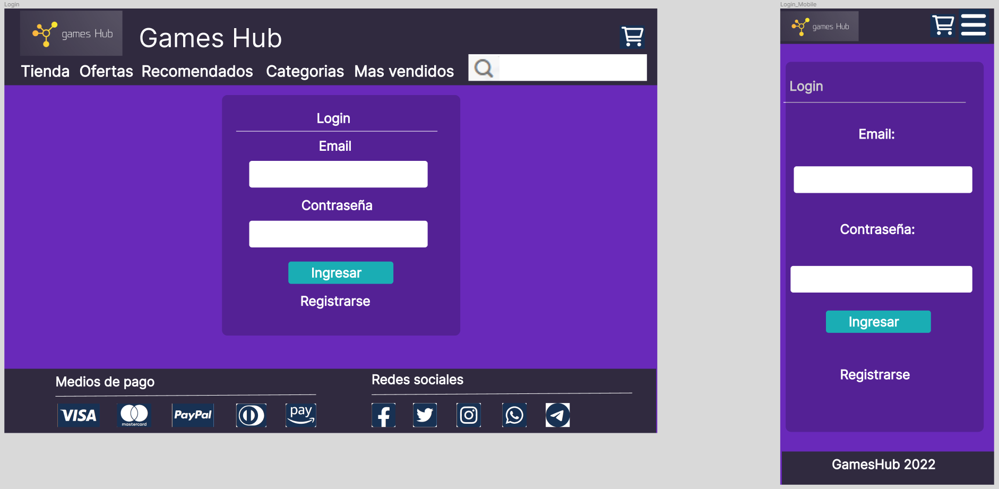
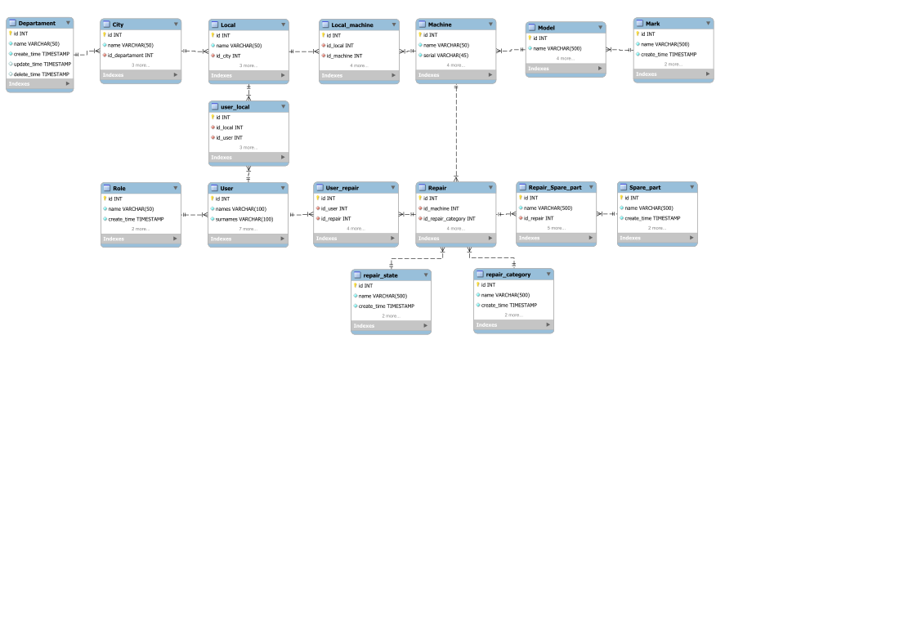

# ***GamesHub***

## Sitio web para compra de videojuegos y consolas de juego

### Audiencia objetivo:

Personas con el objetivo de crear un sistema de reporte de incidencias

### Integrantes del grupo: 

#### ___Gustavo Avella:___

Ingeniero en electronica , amante de la tecnologia y los proyectos de innovacion , entusiasta de las nuevas tendencias tecnologicas.

### Enlace del diseño:

El diseño preliminar se ha realizado con *Figma* y se puede encontrar en la siguiente URL

https://www.figma.com/file/FaSg1WJLw2FJhlEZvasdAZ/Digital_House?node-id=161%3A238

## Diseño 

#### Homepage: 

#### Article: 

#### Carrito:
 

 #### Login:
 

 #### Register:
 

### Para clonar el repositorio usar:

`git clone https://github.com/gusavella/BACKEND_INCIDENTS_DMDS.git `

### Para actualizar el repositorio local usar:

`git pull https://github.com/gusavella/BACKEND_INCIDENTS_DMDS.git `

### Para actualizar el repositorio remoto usar:

`git push https://github.com/gusavella/BACKEND_INCIDENTS_DMDS.git `

## Ejecucion
Se descarga el repositorio bien sea clonado o descarga directa

### Creacion de base de datos 
Dentro de los archivos de repositorio existe la carpeta database_files
Dentro de esta carpeta se encuentran los archivos ***creacion DB 3.0.sql*** y ***INSERTA DATOS EN BD 3.0.sql***.
Ejecutar en workbench o cualquier manejador de base de datos (dveaver,consola, etc...) el archivo ***creacion DB 3.0.sql*** este crea el esquema de base de datos.
Enseguida ejecutar ***INSERTA DATOS EN BD 3.0.sql***, este crea datos iniciales en la base de datos.

### Ejecucion de proyecto de Node

Luego por consola de Visual sudio code (o terminal) ejecutar `npm install` para descargar todas las dependencias del proyecto.
En seguida se ejecuta en modo desarrollo por medio del comando `nodemon run dev`

## Modelo Base de datos:

